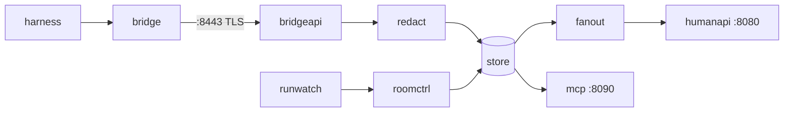

# agent-platform: contributor and agent guide

The Go services behind SP2 collaboration rooms: `room-broker` (the log of record, its API and
the `Room` controller) and `room-bridge` (the sidecar that mirrors a run's harness into its
room). Architecture and ports: [README](README.md). Prerequisites, commits, migrations and
releases: `CONTRIBUTING.md`.

## Quality gate: run before every commit

```bash
task check      # exit 0, or it is not done
```

| Step | Runs | Fails on |
|---|---|---|
| `spdx` | `hack/spdx.sh` | a `.go` file, tracked or new, whose first line is not `// SPDX-License-Identifier: Apache-2.0` |
| `tidy` | `go mod tidy -diff` | `go.mod` or `go.sum` drift |
| `lint` | `hack/lint.sh` | any golangci-lint issue under [`.golangci.yaml`](.golangci.yaml), gofmt and goimports included |
| `vuln` | `go run …/govulncheck@v1.8.0 ./...` | a known vulnerability reachable from our code, stdlib included |
| `test` | `go test -race -count=1 ./...` | a failing test or a data race; never cached |

CI's `check` job runs the same `task check`; `analyze` (CodeQL) is the other required check.
Store tests use testcontainers, so from phase 1 `task test` needs a running Docker daemon.

**Lint through `task lint`, never a bare `golangci-lint run`.** A v1 binary often sits earlier
on PATH (`go install …/golangci-lint` drops one into `$GOPATH/bin`), and v1 cannot read a v2
config. `hack/lint.sh` takes `$GOLANGCI_LINT`, else `mise which golangci-lint` (the pin in
`mise.toml`), else PATH, and refuses anything that is not v2 with the fix in the message. It
also pins `GOTOOLCHAIN` to `go.mod`: under a newer Go, golangci-lint's bundled staticcheck
panics and aborts the whole run. Never answer that with `--disable=staticcheck`. `vuln` goes
through `go run` for a sibling reason: a `govulncheck` built by an older Go fails to load
packages that need a newer one.

## Conventions

### Shape

- **Packages by domain or pipeline stage, never by layer.** No `service/`, `repository/`,
  `handler/`, `models/`, `utils/`, `pkg/`. A package's `// Package …` comment is its contract;
  read it before changing the package.
- **`cmd/<bin>/main.go` stays thin.** It builds the root context and logger and calls
  `app.Run<Bin>(ctx, args, stdout) error`; constructing the store, manager and servers lives in
  `internal/app`, one file per binary or subcommand, where tests can call it. `main` alone calls
  `os.Exit`.
- **Interfaces belong to the consumer and stay minimal.** `roomctrl` declares the two store
  methods it calls, not `*store.Store`. Often unexported; duplicating a one-method interface in
  two packages is fine. Constructors return concrete types.
- **Plain constructor injection.** No package-level state beyond `version.Version`, no `init()`
  doing work.
- **Exported symbols carry doc comments** (enforced by `revive`): the comment states the
  contract, and a non-obvious *why* sits next to the code rather than in a separate log.

### Idioms

- **`ctx context.Context` first** on every function that does I/O or blocks. Never store it in
  a struct. `context.Background()` appears in `main` and in the shutdown drain only.
- **Errors wrap with `%w`** (`fmt.Errorf("append event: %w", err)`) and compare with
  `errors.Is` / `errors.As` only, `http.ErrServerClosed` included (`errorlint`).
- **Typed errors for what callers branch on:** sentinels (`store.ErrNoRoom`,
  `store.ErrSealed`), or a struct with `Unwrap()` when the caller needs a field, such as
  retryable against permanent in the bridge's uploader. Each API maps them to status codes in
  one place.
- **`log/slog` only, injected.** Constructors take a `*slog.Logger`; library code never calls
  `slog.Default()`. JSON in the cluster, text locally, format and level overridable by env.
  `forbidigo` bans `fmt.Print*` and `log.Print|Fatal|Panic*` outside `cmd/` and tests.
- **Strict config.** One `Load(path)`: decode rejecting unknown fields
  (`yaml.Decoder.KnownFields(true)` / `json.Decoder.DisallowUnknownFields`), then the one
  `ApplyDefaults`, then `Validate()`. A typo fails startup. Secrets are referenced by env-var
  name or mounted-file path (`ROOM_TOKEN_FILE`, `ClientIDFile`) and read at use, so a rotation
  needs no restart.
- **Every `http.Server` sets its bounds:** `ReadHeaderTimeout`, `ReadTimeout`, `IdleTimeout`,
  `MaxHeaderBytes` and `WriteTimeout`. A listener that streams (SSE on `:8443`, WebSocket on
  `:8080`) sets `WriteTimeout: 0` and bounds each non-streaming route with
  `http.TimeoutHandler` or `http.ResponseController` deadlines instead. Shutdown:
  `signal.NotifyContext(SIGINT, SIGTERM)`, then a separate drain context bounded under the pod's
  `terminationGracePeriodSeconds`.
- **One audited egress client**, `internal/httpx`: timeout, redirect cap, credential headers
  stripped on a cross-host redirect, cloud metadata addresses refused. `forbidigo` bans
  `http.DefaultClient` and `http.Get|Head|Post|PostForm` everywhere else, tests included (use
  `httptest.Server.Client()`); review catches a hand-rolled `&http.Client{}`.
- **Injectable clock.** Time-dependent code takes `now func() time.Time` or a small clock
  interface. `forbidigo` bans `time.Sleep` outside tests: wait on `select` over `ctx.Done()` and
  a timer.
- **Bounded concurrency.** A fixed worker count or a semaphore, never a goroutine per event.
  Every goroutine has an owner that waits for it (`sync.WaitGroup`, `errgroup`) and a context
  that stops it. Every buffer has a cap (the bridge's `MaxBuffer`).

### Tests

- **TDD.** The failing test first, then the least code that passes it.
- **Table-driven** `t.Run` by default; case names state the behaviour.
- **stdlib `testing` only.** No testify, gomock or mockery. Hand-written `fake…` structs
  implement the consumer's interface; assert on behaviour, not on call sequences.
- **Doubles by boundary:** `httptest` for HTTP, controller-runtime's fake client for the
  reconciler, and **testcontainers-go Postgres for `internal/store` only**: grants, RLS and
  constraints need the real server. Every other package fakes the store interface.
- **Goldens only for rendered artifacts** (a rendered page, a generated manifest), in
  `testdata/` beside the package, rewritten only by an explicit flag such as
  `go test ./internal/x -update-golden`. Never golden a value you can assert on.
- **`-race` always.** `task test` has it; do not drop it to make a flake pass.

### Observability

- **Metrics:** the OpenTelemetry metric API with the Prometheus exporter on `:9090`. Every name
  starts `rooms_` (the SP2 §9 set, e.g. `rooms_events_appended_total`); counters end `_total`,
  durations `_seconds`. Buckets per histogram family sit on real thresholds (SC-12: fan-out p95
  under 0.5 s). Instruments hang off an injected set that works with a no-op provider in tests.
  Label values are bounded: never a payload field; `room` only on the per-Active-room gauge.
- **`rooms_build_info{version}` = 1** from the first metric.
- **Traces are expected here** (RunLore has none): OTel spans across bridge → broker → store and
  outbound calls, W3C `traceparent` propagated on every hop. Spans carry ids (room, run, seq),
  event types and end reasons, never payload text or an error message that could echo it.

### Added with first use, not before

| Package | Lands with |
|---|---|
| `internal/httpx` | the first outbound call (JWKS fetch, bridge → broker) |
| `internal/logging` | the first binary that logs |
| OTel setup and `rooms_build_info` | the first metric or span |
| `internal/app` | the first binary with real wiring |

## Package map

By pipeline stage. ✓ exists today; a number is the SP2 phase that adds it.



| Stage | Package | Contract | Status |
|---|---|---|---|
| Entry | `cmd/room-broker` | `serve` and `retention` subcommands | ✓ stub |
| Entry | `cmd/room-bridge` | the sidecar binary | ✓ stub |
| Entry | `cmd/roomctl`, `internal/roomctl` | the human CLI and its client | 6 |
| Entry | `internal/app` | wiring per binary, the only importer of every adapter | not in the SP2 plan |
| Entry | `internal/config` | the broker's config file: strict decode, defaults, validation | 1 |
| Entry | `internal/version` | build version stamped by `-ldflags` | ✓ |
| Ingress | `internal/bridge` | harness adapter over loopback, event mapping, status, uploader, SSE consumer | 1, 4, 5 |
| Ingress | `internal/wire` | bridge and browser frames: the types both ends of a connection share | 1, 2 |
| Ingress | `internal/authn` | offline JWT verification for runs, system callers and humans; principal mapping | 1, 2 |
| Log | `internal/envelope` | C4 v1 event types, payload builders, validation, limits | 1 |
| Log | `internal/redact` | gitleaks detection over every JSON string of a payload | 1 |
| Log | `internal/store` + `migrations/` | append, range, cursors, seal; the only package that speaks SQL | 1, 4, 5, 6 |
| Rooms | `api/v1alpha1` | `Room` types and deepcopy; CRD generated into `config/crd/` | 1 |
| Rooms | `internal/runwatch` | `AgentRun` informer: liveness, membership, run events, end reason | 1 |
| Rooms | `internal/roomctrl` | `Room` reconciler: row, seq 1, finalizer, status projection | 1 |
| API | `internal/bridgeapi` | `:8443`: hello, events, SSE stream, system API, approvals | 1, 4, 5 |
| API | `internal/mcp` | `:8090` MCP server, the `room_*` tools | 3 |
| API | `internal/github`, `internal/verdictpost` | the factory App client; the leader's verdict comments | 3 |
| API | `internal/brief`, `internal/runrequest` | fenced brief; manifest and factory run requesters | 4 |
| Viewers | `internal/fanout` | Valkey hint hub with a Postgres poll fallback | 2 |
| Viewers | `internal/policy` | the §1 permission matrix | 2 |
| Viewers | `internal/humanapi` + `ui/dist/` | `:8080` WebSocket, room list, actions, embedded UI | 2 |
| Viewers | `web/` | TypeScript UI and its vitest suite | 2 |
| Ops | `internal/metrics` | the §9 metric set | 1 |

## Seams

The core carries no platform-specific constants — no cluster names, domains, OpenBao paths,
Crossplane kinds, ZITADEL ids or other cloud specifics — in `internal/envelope`,
`internal/redact`, `internal/store`, `internal/httpx` or `internal/wire`. Platform facts enter
through config, or through a consumer-side interface defined where they're used (see
Idioms above).

Packages that do touch the platform name their seam:

| Package | Seam |
|---|---|
| `internal/authn` | issuer and audience are config |
| `internal/runwatch` | the `AgentRun` GVK and namespace; a `RunSource` interface would replace them in a spin-out |
| `internal/roomctrl` | the `Room` CRD group |
| `internal/bridgeapi` | principal allowlists come from config |

Why: the project may go platform-agnostic after the phase-7 UX sign-off, decided if 2 of 4 hold
— daily use, AHP 1.0 still leaving identity and audit out, a second harness or runtime needed,
outside demand. Keeping the seams clean now makes that decision cheap.

## Security rules

- **Nothing unredacted leaves the request.** `redact` runs on every payload before it is
  appended, logged, traced, counted or put in an error. Log and trace ids, seq and event type,
  never a payload or a header value.
- **SQL only in `internal/store`, parameterised** (`$1`, `$2`). Never build SQL from a value;
  identifiers are constants.
- **The broker's role is append-only by design.** `rooms_broker` holds `SELECT, INSERT` on
  `events`, and row-level security is on; only `rooms_retention` deletes, and only expired rooms.
  A migration never widens a grant, disables RLS or gives `rooms_broker` `UPDATE` or `DELETE` on
  `events`. The store tests prove it (SC-10); a change that breaks them is a design change, not
  a test fix.
- **No secret on argv.** Tokens, keys and DSNs come from mounted files or the environment,
  never flags or a child process's arguments: `/proc/<pid>/cmdline` is world-readable.
- **TLS on `:8443`.** The broker serves it with a reloading `GetCertificate`; the bridge
  verifies against `BROKER_CA_FILE` and refuses a non-`https://` `BROKER_URL`. Never
  `InsecureSkipVerify`, tests included (use `httptest.NewTLSServer`'s client).
