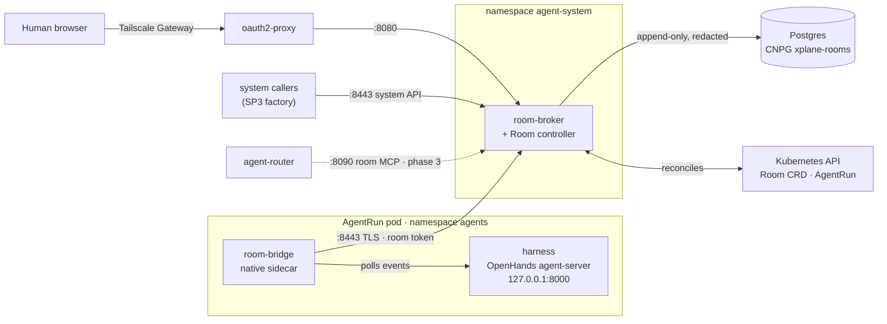

# agent-platform

The Go services behind **collaboration rooms** (SP2) of the Agent Factory built on
[cloud-native-ref](https://github.com/Smana/cloud-native-ref). A room is one live session per
`AgentRun`: several humans and agents share it. The transcript, handoffs and end reason land in an
append-only, redacted Postgres log that outlives the sandbox pod. The programme keeps its new Go
code in this one repo (the SP3 factory joins it later), released as versioned images that the
platform repo pins and deploys, as it does App Wizard.

> **Status:** early. Both binaries are stubs until SP2 phase 1 lands; this repo only proves the
> toolchain, gates and image pipeline today.

**Documentation:** [docs/](docs/README.md) covers the architecture, the event envelope, the room
log's guarantees, the API, security, integration, operations, development and the roadmap.

## Architecture



| Port | Who calls it | Phase |
|---|---|---|
| `:8080` | Humans, through oauth2-proxy (live viewer, then driver and approvals) | 2 |
| `:8443` | `room-bridge` per run; system callers such as the SP3 factory | 1 |
| `:8090` | Agents' `room_*` tools over MCP, through `agent-router` only | 3 |
| `:9090` | Metrics and probes | 1 |

Later phases add the driver/steering channel (4), approvals (5) and forking with `roomctl` (6).

## Binaries and images

| Binary | Runs as | Image |
|---|---|---|
| `room-broker` | Stateless service in `agent-system`; owns the `Room` CRD (`agents.ogenki.io/v1alpha1`) | `ghcr.io/smana/room-broker` |
| `room-bridge` | Native sidecar in every `AgentRun` pod that names a room; relays harness events, carries the room token | `ghcr.io/smana/room-bridge` |
| `agent-factory` | SP3's orchestrator in `agent-system`, two replicas, one leading; owns the `Task` CRD; chart `oci://ghcr.io/smana/charts/agent-factory` | `ghcr.io/smana/agent-factory` |

Both images are multi-arch (`linux/amd64`, `linux/arm64`), static binaries on distroless `nonroot`.

## Releases

| Trigger | Tag | Workflow |
|---|---|---|
| Each push to a PR from this repo | `v<next-patch>-pr<N>.<sha8>`, `<sha8>` = the PR **head** | `ci.yaml` → `prerelease` |
| The same push, the factory chart | `<next-patch>-pr<N>.g<sha8>` (the `g` keeps it semver) | `ci.yaml` → `chart-prerelease` |
| A `v*` git tag | the tag, e.g. `v0.1.0` | `release.yaml` |

Never `latest`. Consumers pin by digest. Every pushed image carries SLSA provenance (`mode=max`) and
an SBOM as attestations, and a keyless cosign signature on its digest:

```bash
cosign verify ghcr.io/smana/room-broker@sha256:<digest> \
  --certificate-oidc-issuer https://token.actions.githubusercontent.com \
  --certificate-identity-regexp '^https://github\.com/Smana/agent-platform/\.github/workflows/release\.yaml@refs/tags/v'
```

That accepts released images only. PR pre-releases are not release-grade (they run unreviewed branch
code): see [verifying an image](docs/security.md#supply-chain) for their variant.

## Where it plugs in

| Repo | Consumes |
|---|---|
| [cloud-native-ref](https://github.com/Smana/cloud-native-ref) | Deploys the broker (`App` claim), its CNPG database `xplane-rooms`, the `Room` CRD, RBAC and network policies |
| [crossplane-configuration](https://github.com/Smana/crossplane-configuration) | The `AgentRun` composition injects the `room-bridge` sidecar and its room token |

Design: [SP2 collaboration rooms](https://github.com/Smana/cloud-native-ref/blob/main/docs/superpowers/specs/2026-09-23-agent-collaboration-rooms-design.md),
part of the [Agent Factory programme](https://github.com/Smana/cloud-native-ref/blob/main/docs/superpowers/specs/2026-09-23-agent-factory-design.md).

## Develop

```bash
mise install    # Go, golangci-lint, task, govulncheck, pinned in mise.toml
task check      # every gate CI runs: go mod tidy drift, golangci-lint, govulncheck, go test -race
```

Store tests use testcontainers (from phase 1), so they need a running Docker daemon.

CI also runs CodeQL on every PR and weekly, and OpenSSF Scorecard weekly on `main`. Report
vulnerabilities privately: see [SECURITY.md](SECURITY.md).

## License

Apache-2.0
