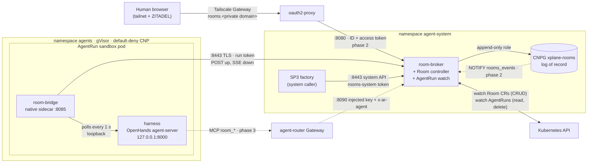
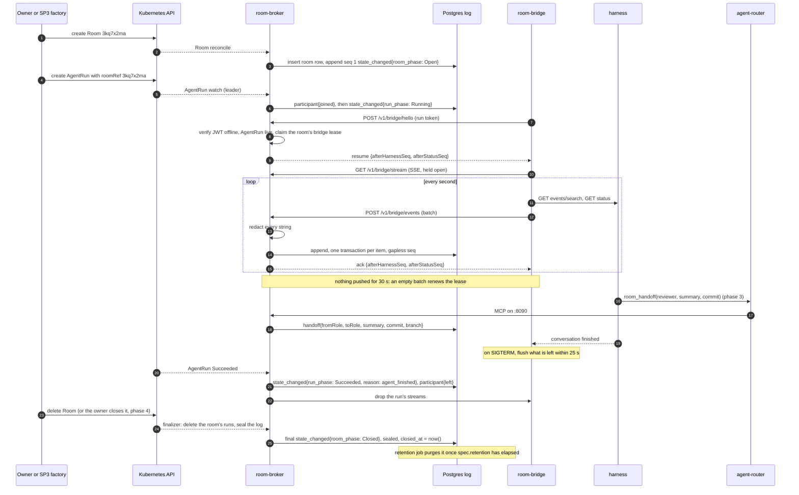

# Architecture

Two binaries. **`room-broker`** is a stateless service in `agent-system`: it owns the `Room` CRD,
authenticates every writer, redacts and sequences events, and stores each room's log in Postgres.
**`room-bridge`** is a native sidecar in every `AgentRun` pod that names a room: it polls the harness
on loopback and pushes its events to the broker over TLS on `:8443`. **Nothing dials into a
sandbox**; every connection from the `agents` namespace is one the pod opens (C4).

## Components

| Component | Runs | Does | Status |
|---|---|---|---|
| `room-broker` | Deployment `room-broker` in `agent-system`, from an `App` claim. 1 replica in phase 1, 2 with a PDB from phase 2 | The log of record, the Room controller, the `:8443`, `:8080`, `:8090` and `:9090` listeners, the retention job (`room-broker retention`) | AP-1 |
| `room-bridge` | Native sidecar (`restartPolicy: Always`) after `identity-proxy`, in every run pod with `spec.roomRef` | Mirrors the harness into the room; carries steering, interrupts and decisions back over one SSE stream | AP-1 |
| Room controller | Inside the broker, reconciling `Room` CRs | Creates the room's log row and its first event, projects `status`, runs the finalizer that seals the log | AP-1 |
| `AgentRun` watch | Inside the broker, on every replica | Admits bridges of live runs only, drops a run's connections when it ends, records joins, phases and end reasons | AP-1 |
| Log store | CNPG `SQLInstance xplane-rooms`, database `rooms` | Append-only events, one gapless `seq` per room | AP-1; the claim S1 (planned) |
| `Room` CRD | `agents.ogenki.io/v1alpha1`, namespaced | The room's policy and projected status ([reference](concepts.md#the-room-crd)) | AP-1 |
| Fan-out | Postgres `LISTEN`/`NOTIFY` on channel `rooms_events`, one listener connection per replica | Every append notifies `"<room> <last_seq>"` in its own transaction, so only committed events are announced. Each replica reads a notified room once for all its viewers, and polls every second while its listener is down ([connection budget](#connection-budget)) | Planned, phase 2 / AP-2 |
| Web UI | Embedded in the broker, TypeScript, behind oauth2-proxy | Watch, then post, steer, approve and fork | Planned, phases 2–6 |
| `roomctl` | A CLI on a developer's machine | Watch, post, queue and fork from a terminal; never steer or approve (ruling P18) | Planned, phase 6 / AP-6 |

## Trust boundaries

| Boundary | Crossed by | Control |
|---|---|---|
| Sandbox → broker | The bridge's `POST` and SSE on `:8443` | TLS (GP-18); an audience-bound run token checked offline, then a live `AgentRun` watch; the run CNP opens this egress only when `roomRef` is set; the bridge lease admits one run per room |
| Harness → bridge | Nothing: the bridge calls the harness, on loopback | The harness never holds the room token: only the bridge container mounts it |
| Human → broker | oauth2-proxy → `:8080` | ZITADEL SSO, agent groups, re-validated ID and access tokens, `Origin` check, `SameSite=Strict` cookie (phase 2) |
| Agent tools → broker | `agent-router` → `:8090` | The gateway authenticates the run and injects a key; the broker derives the run from `x-ar-agent` and its role from the `AgentRun`, never from a header (phase 3) |
| System callers → broker | `:8443` system API | Audience `rooms-system`, and `sub` in an explicit allowlist |
| Broker → database | Postgres `:5432` | The `rooms_broker` role: append and read events; no update or delete. Ruling Y moves the remaining guarantees into the database |
| Broker → Kubernetes | The API server | Read and delete `AgentRun`s, never create (C3); CRUD on `Room`s; no cluster-admin |

## One run's life

A room is created, a run joins it, its events stream in, it hands off and ends, and the room is
eventually sealed and purged. Steps marked *(phase N)* are planned; the rest is phase 1.

A second run whose bridge says hello while the first is live gets `409 room_busy`, and the broker
appends `state_changed{kind: limit, reason: concurrent_run}` (ruling P17). Before SP3 ships, the
owner starts each run with `task agent:run -- --room <id>`; the broker never creates one.

## Replicas and the leader

Any replica serves any room. The replicas elect one leader through a Kubernetes lease named
`room-broker`.

| Work | Who does it | Why |
|---|---|---|
| Serve bridges, the system API, humans and tools | Every replica | Stateless; the database serialises writers per room |
| Cut a run's connections when it ends | Every replica | Each holds its own connections |
| Append run lifecycle events (`participant`, `run_phase`) | The leader | Every step has a fixed idempotency key, so a new leader replays without writing twice |
| Project `Room.status` | The leader, every 15 s and on phase changes (ruling P21) | One status write per event would load the API server |
| Post verdicts to GitHub | The leader, sweeping every 15 s (phase 3) | One comment per verdict, marked so a new leader never posts twice |
| Expire a lapsed human driver's lease, back to the room's system holder | The leader, sweeping every 30 s (phase 4) | Each change is keyed on its epoch and re-checks the lapse under the room's row lock, so a new leader never moves a token twice |
| Deliver new events to viewers | Every replica, for its own viewers (phase 2) | Each `LISTEN`s once; notifications coalesce per room, so one read serves every viewer |

### Connection budget

About 30 of the database's 100 connections (PostgreSQL's default `max_connections`). There is no
PgBouncer, so `LISTEN` holds a plain session.

| Holder | Connections |
|---|---|
| Two replicas: a pool of 8 (`pool_max_conns`, overridable in the URL) plus 1 listener each | 18 |
| A third pod during a rolling update | 9 |
| The daily retention job | up to 8, in practice 1 |
| The Atlas operator's migrations | 1–2 |

## Nothing is lost while the sandbox lives

The harness keeps its own event store, so a broker or database outage delays the log without losing
events.

| Failure | Behaviour |
|---|---|
| Broker unreachable at start | The bridge retries `hello` with backoff up to 5 s, forever. The sandbox never stops for it |
| Broker or database down mid-run | The bridge buffers up to 8 MiB, then stops polling (back-pressure) and resumes from the log's cursor |
| Bridge restarted | `hello` returns the last stored cursor; re-sent items are dropped by their idempotency key |
| Pod terminating | The bridge polls once more and flushes within 25 s of the 30 s grace period |
| Room sealed (`410`) | The bridge stops mirroring |
| A run ends or is revoked | Its connections are dropped on the watch event, not at a later token check |

A replayed harness event keeps its key: event *i* owns item keys `4i … 4i+3` (at most four C4 items
per harness event). One known limit (ruling P35): if the harness skips an event file it cannot read,
a restarted bridge can miss that event or re-append later ones under new keys.

## Code layout

The code follows Go conventions and a clean architecture modelled on
[RunLore](https://github.com/Smana/runlore). [AGENTS.md](../AGENTS.md) owns the full standard; four
rules shape the tree.

| Rule | In practice |
|---|---|
| Packages split by domain or pipeline stage, never by layer | `envelope`, `redact`, `store`, `authn`, `runwatch`, `roomctrl`, `bridgeapi`, `bridge`, `policy`, `fanout`, `humanapi`, `mcp`: no `service/`, `repository/` or `handler/` |
| `cmd/<bin>` stays thin | `cmd/room-broker`, `cmd/room-bridge` and `cmd/roomctl` parse arguments and dispatch; the wiring lives in `internal/app` (Ruling AC: the plan's task 1.12 wires the broker in `cmd/room-broker`, and moves there instead) |
| Interfaces are declared on the consumer side | A package asks for the few methods it calls (the bridge API's `Log`, the controller's `Store`) instead of importing a wide type |
| The store is the only SQL adapter | Nothing outside `internal/store` writes SQL, the retention job's `DELETE`s included |
| One egress client | Every outbound HTTP call goes through `internal/httpx`; a lint rule bans the bare `net/http` helpers elsewhere |

| Package | Stage | Phase |
|---|---|---|
| `internal/envelope` | The C4 types, validation and limits | 1 |
| `internal/redact` | Secret detection over every JSON string | 1 |
| `internal/store` (+ `migrations/`) | The Postgres log: append, range, cursors, seal, lease; later driver, queue, approvals, fork | 1, 4, 5, 6 |
| `internal/authn` | Offline JWT for runs, system callers and humans | 1, 2 |
| `internal/runwatch` | The `AgentRun` watch: liveness, membership, run events, end reasons | 1 |
| `internal/roomctrl` | The `Room` reconciler: row, first event, finalizer, status | 1 |
| `internal/wire` | Bridge and browser frames | 1, 2 |
| `internal/bridgeapi` | The `:8443` handlers | 1, 4, 5 |
| `internal/bridge` | The sidecar: harness adapter, mapping, uploader, SSE consumer, classifier | 1, 4, 5 |
| `internal/config`, `internal/metrics` | The broker's config file and metric set | 1 |
| `internal/policy`, `internal/fanout`, `internal/humanapi` | The §1 matrix, the LISTEN/NOTIFY fan-out hub, the `:8080` API and UI | 2 onwards |
| `internal/mcp`, `internal/github`, `internal/verdictpost` | Room tools, the factory App client, verdict comments | 3 |
| `internal/brief`, `internal/runrequest` | The fenced brief, run requests | 4 |
| `api/v1alpha1` | The `Room` types; `config/crd/` holds the generated CRD | 1 |
| `internal/app` | The wiring of each binary and subcommand: `serve`, `retention`, the bridge, `roomctl` (Ruling AC) | 1, 6 |
| `internal/httpx` | The one audited egress client: timeouts, a redirect cap, no credential header across hosts. It arrives with the first outbound call (the JWKS fetch, task 1.6) | 1 |

## Where each piece lives

| Resource | Namespace | Defined in | Built from |
|---|---|---|---|
| `room-broker` Deployment and Service (`App` claim `room-broker`) | `agent-system` | [cloud-native-ref](https://github.com/Smana/cloud-native-ref) `infrastructure/base/room-broker/` (S1) | Image `ghcr.io/smana/room-broker`, this repo |
| `Room` CRD | cluster; CRs in `agent-system` | Vendored by cloud-native-ref as `crd-rooms.yaml` | `api/v1alpha1`, `config/crd/` here |
| `SQLInstance xplane-rooms` (CNPG) | `agent-system` | cloud-native-ref (S1) | Composition in [crossplane-configuration](https://github.com/Smana/crossplane-configuration) (CC-S1); migrations `internal/store/migrations/` here |
| Retention CronJob `room-broker-retention` | `agent-system` | cloud-native-ref (S1) | The broker image, `retention` subcommand |
| `Certificate room-broker-tls` | `agent-system` | cloud-native-ref (S1, GP-18) | cert-manager, ClusterIssuer `openbao` |
| `room-bridge` sidecar and its `room-token` volume | `agents` | crossplane-configuration's `AgentRun` composition (CC-S2) | Image `ghcr.io/smana/room-bridge`, this repo |
| Secret `room-broker-ca` | `agents` | cloud-native-ref ExternalSecret (S1, GP-18) | The platform's private CA |
| CNPs, `VMServiceScrape`, `VMRule` | `agent-system`, `observability` | cloud-native-ref (S1 onwards) | — |
| oauth2-proxy, `HTTPRoute` | `agent-system` | cloud-native-ref (S2) | — |
| `agent-router` MCPRoute backend for `:8090` | `agent-system` | cloud-native-ref (S3) | — |

[Integration](integration.md) lists every pull request and pin.
