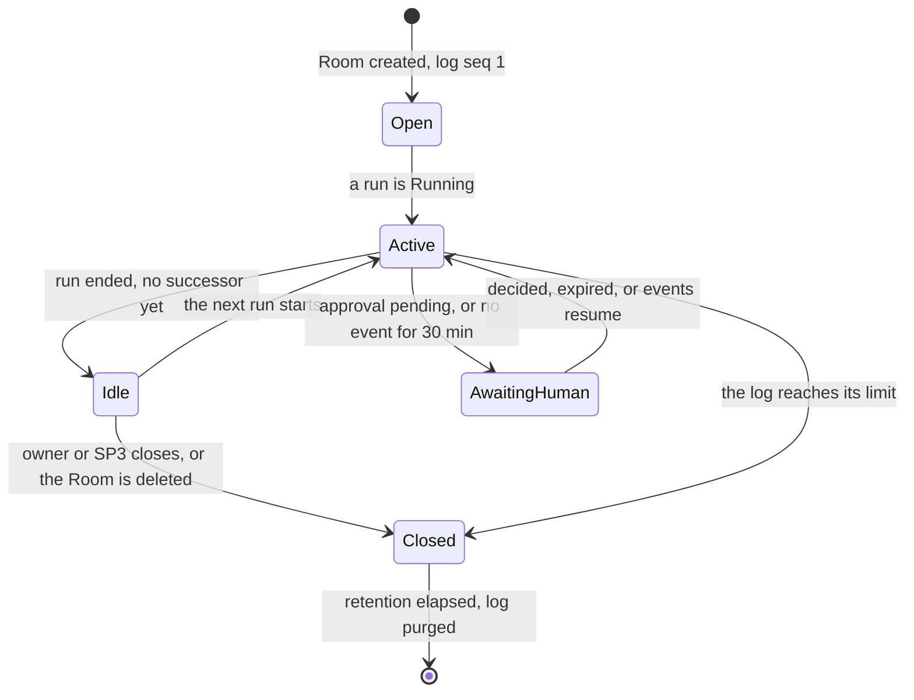

# Concepts

A **room** is one append-only, ordered log for a piece of work. Humans and agent runs are its
participants. Everything they do, and everything that happens to them, becomes an event in that log
with a gapless sequence number that only the broker assigns. The rest of this page names the parts.

## Glossary

| Term | Meaning | Where it lives | Status |
|---|---|---|---|
| **Room** | One session: its policy (owner, driver, members, approvals, retention, data class) and its log. Rooms are runtime objects, created by SP3's factory, the broker or the owner, never committed to Git | `Room` CR (`agents.ogenki.io/v1alpha1`) in `agent-system`, named with a C2 id; its log in Postgres | AP-1 (CRD in progress) |
| **Run** | One agent, one role, one task, one branch, with a deadline. It joins a room by naming it in `spec.roomRef`. One run is `Running` per room at a time | `AgentRun` claim (`cloud.ogenki.io`) in `agents`, owned by SP1 | Built in SP1 |
| **Harness** | The agent loop inside the sandbox: the OpenHands agent-server on `127.0.0.1:8000` | The run's pod | Built in SP1 |
| **Bridge** | `room-bridge`, a native sidecar in every run pod that has a `roomRef`. It polls the harness and pushes its events to the broker; it carries steering, interrupts and decisions back | The run's pod, namespace `agents` | AP-1 (planned, task 1.11) |
| **Broker** | `room-broker`, the stateless service that owns rooms: it authenticates writers, redacts, sequences and stores events, and serves them | `agent-system` | AP-1 (planned, tasks 1.6–1.12) |
| **Participant** | Anyone in a room: a human, a run, or a system principal. Joining and leaving are `participant` events | The log | AP-1 for runs; planned, phase 2 for humans |
| **Principal** | A canonical identity: `agent:<runId>`, `human:<zitadel sub>` or `system:<component>` (C2). The broker stamps it on every event from the authenticated credential | Every event's `actor.id` | AP-1 |
| **C2 id** | 8 characters of lowercase unpadded base32, `[a-z2-7]{8}`. Room, run and task ids share the format, so `agent/<id>` branches match the merge gate | Names of rooms and runs | AP-1 |
| **Run role** | What a run may do: `implementer`, `reviewer`, `tester` or `triager` (C2). A policy input, not an identity | `AgentRun.spec.role`; an agent event's `actor.role` | Built in SP1 |
| **Room role** | What a human may do in a room: `watcher` < `collaborator` < `owner`, cumulative. **Approver** is a separate flag | `Room.spec.members` | Planned, phase 2 / AP-2 |
| **Driver** | The one principal allowed to steer or interrupt the running run. A token that moves with *give*, *request* and *take*; each change bumps `driverEpoch`, which fences races | `rooms.driver`, `driver_epoch`; `driver` events | Planned, phase 4 / AP-4 |
| **Message delivery** | `none` (chat, delivered to nobody), `queued` (FIFO, goes into the next run's brief) or `steering` (injected into the running run now, driver only) | `message` payload | `none` AP-1; the others planned, phase 4 |
| **Handoff** | A run hands *work* to the next role, with the commit it stopped at. The next run starts from that commit. Not a change of driver | `handoff` event | Planned, phase 3 / AP-3 |
| **Verdict** | A reviewer's or tester's `approve` or `changes`, recorded as `message{kind: review_verdict}`. The broker also posts it on the pull request as one comment | The log; the PR | Planned, phase 3 / AP-3 |
| **Brief** | The fenced, bounded text the next run starts from: the last handoff and verdict, plus the queued messages, quoted as untrusted data | Built by the broker | Planned, phase 4 / AP-4 |
| **Approval** | A human decision on a pending harness action. Oversight, not a security boundary: a run's capabilities are fixed at creation. The first valid decision wins | `approval_requested`, `approval_decided` | Planned, phase 5 / AP-5 |
| **Fork** | A new room copied from a prefix of another, events `1..N` with their `seq`, owned and driven by whoever forked it | New `Room`; `state_changed{forked_from}` | Planned, phase 6 / AP-6 |
| **Envelope** | The frozen C4 v1 shape of every log entry: `v, id, seq, roomId, runId, actor, type, causedBy, origin, ts, redactions, payload` | [Event envelope](event-envelope.md) | AP-1 |
| **seq** | The per-room sequence number: gapless from 1, assigned by the broker under the room's row lock | `events.seq`, `rooms.last_seq` | AP-1 |
| **Origin** | Who produced an event: `harness` (mirrored from a run), `client` (a human, a system caller, a room tool) or `broker` | Every event | AP-1 |
| **Idempotency key** | `(roomId, originClient, originSeq)`: a writer's own sequence number. A replayed key returns the stored event and appends nothing | `events` unique index | AP-1 |
| **Seal** | The last event of a room. After it, nothing can append. A room seals when it closes or fills up (100 000 events or 256 MiB), and sealing starts its retention clock | `rooms.sealed`, `closed_at` | AP-1 |
| **Retention** | How long a closed room's log is kept: `spec.retention`, `<n>d`, default `90d` (OD-17). A daily job deletes expired sealed rooms | `rooms.retention` | AP-1 (job planned, task 1.12) |
| **Bridge lease** | Which run's bridge holds the room. A second live run's bridge is refused `409 room_busy`. With Ruling Y, the lease also fences writes: a displaced bridge cannot append | `rooms.bridge_run`, `bridge_seen_at` | AP-1; fencing AP-1, Ruling Y |
| **Data class** | `public` or `internal` (C3): which model backends a run may reach. A room's runs inherit its class; an internal room's verdict comment carries no summary | `Room.spec.dataClass` | AP-1 |
| **Tier** | A logical model name on the agent gateway: `tier-light`, `tier-standard`, `tier-frontier` (C5), chosen once per task by SP3's classifier (C7). Rooms do not carry or change it: escalating a task means a new run, never a switch inside one | `AgentRun.spec.model` | Owned by SP4 |
| **Redaction** | Replacing a detected secret with `[REDACTED:<rule>]` before the event is stored, and listing the rule in `redactions` | The broker | AP-1 |
| **End reason** | Why a run ended: `agent_finished`, `agent_error`, `agent_stuck`, `deadline`, `pod_lost`, `revoked`, `deleted` or `budget-*` (ruling P15). The `AgentRun` only ever says `Failed`; the room says why | `state_changed{run_phase}` | AP-1 (planned, task 1.7) |

## A room's phases

The broker projects `status.phase` from the log and the room's runs every 15 s (ruling P21).

`AwaitingHuman` from an approval needs phase 5; from a stall it applies from phase 1. Deleting a
`Room` runs the finalizer `agents.ogenki.io/room-log`, which deletes the room's runs and seals the
log. The log keeps its own retention clock after the CR is gone.

## Who does what

| Actor | Creates | Reads | Writes into the log |
|---|---|---|---|
| Owner, before SP3 | `Room` CRs with `kubectl`; runs with `task agent:run -- --room` | SQL; the system API | nothing directly |
| SP3's factory | `Room` CRs and every `AgentRun` (C3: the only creator) | `GET /v1/rooms/{id}/events` | `message{kind: task_state}` |
| A run | nothing | `room_read` (phase 3) | its harness events through the bridge; `room_post`, `room_handoff`, `room_verdict` (phase 3) |
| A human | rooms from the UI (phase 4), forks (phase 6) | the web UI (phase 2), `roomctl` (phase 6) | messages, driver actions, decisions (phases 4–6) |
| The broker | the `Room`s a human asks for, new or forked (phases 4, 6); **never** an `AgentRun` | everything | room and run lifecycle, seals, limits, verdict outcomes |

The full permission matrix is in [Security](security.md#authorization).
