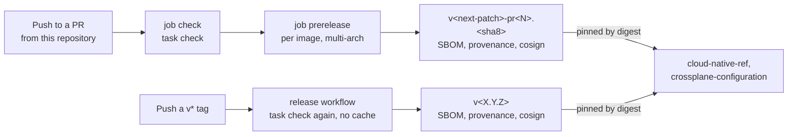

# Development

Install the pinned toolchain with `mise install`, then run **`task check`**: it is exactly the gate CI
runs, and its exit code is the evidence a PR cites. Store tests start a real PostgreSQL in Docker, so
a running Docker daemon is the one extra prerequisite.

The coding standard lives in [AGENTS.md](../AGENTS.md) (conventions, the package map, the gate
command) and [CONTRIBUTING.md](../CONTRIBUTING.md) (the workflow for humans). This page covers the
toolchain, tests, migrations and releases; it does not restate the standard.

## Prerequisites

| Tool | Version | Why |
|---|---|---|
| [mise](https://mise.jdx.dev) | any | Installs everything below from `mise.toml` |
| Go | 1.27.1 | The module |
| golangci-lint | 2.14.0 | Lint, `version: "2"` config |
| go-task | 3.53.1 | `task check` |
| govulncheck | 1.8.0 | Known vulnerabilities |
| Node.js | 24.21.0 | The web UI, from phase 2 |
| Atlas | 1.3.0 | Migration hashing, from AP-1 |
| Docker | a running daemon | testcontainers starts `postgres:18-alpine` for store tests |

```bash
mise install
mise exec -- golangci-lint version     # must print 2.14.0
mise exec -- task check
```

**Trap: a stale linter on `PATH`.** A golangci-lint v1, or an older v2, found before mise's shims
fails on this repo's `version: "2"` config or reports different findings from CI. Run through
`mise exec --`, or put mise's shims first. An old go-task on `PATH` has the same kind of problem.

## `task check`

| Step | Runs | Fails when |
|---|---|---|
| `tidy` | `go mod tidy -diff` | `go.mod` or `go.sum` would change |
| `lint` | `golangci-lint run ./...` | Any finding. The config enables `gosec`, `noctx`, `errorlint`, `bodyclose` and `sqlclosecheck` on top of the standard set |
| `vuln` | `govulncheck ./...` | A known vulnerability is reachable from our code, the standard library included |
| `test` | `go test -race -count=1 ./...` | Any test fails or races |
| `crd:check` (AP-1) | `controller-gen` over `api/...`, then `git diff --exit-code` | The committed CRD in `config/crd/` differs from what the Go types generate |

CI runs `task check` on every PR and push to `main` (job `check`), and CodeQL (job `analyze`); both
are required checks.

### Lint findings to expect

`gosec` and `noctx` are on, and no rule is ever disabled. Fix the code instead:

| Finding | Fix |
|---|---|
| `G304`, reading a file from a variable path | Read `filepath.Clean(path)` |
| `G115`, a narrowing integer conversion | Check the bound, then convert |
| `noctx` on `http.NewRequest` or `httptest.NewRequest` | Use the `…WithContext` variant, with `t.Context()` in tests |

## Tests

```bash
go test -race ./...                        # everything
go test -race ./internal/store/...         # the log, against a real PostgreSQL 18
go test -run TestBrokerRoleIsAppendOnly -v ./internal/store/
```

The store tests do what CNPG does on the cluster: they create the three login roles
(`rooms_owner`, `rooms_broker`, `rooms_retention`), make `rooms_owner` own the database, apply every
migration as `rooms_owner` the way Atlas does, then connect as each role. A grant or policy that only
works for a superuser therefore fails here, not in the cluster. Tests that prove a database guarantee
connect as `rooms_broker` or `rooms_retention` and assert the exact SQLSTATE (`42501` for a refused
privilege).

## Adding a migration

1. Add `internal/store/migrations/<YYYYMMDDhhmmss>_<name>.sql`. Write it for `rooms_owner`, which
   owns the schema but cannot create roles.
2. Add the file to `internal/store/migrations/kustomization.yaml`: the ConfigMap it generates is what
   the cluster's Atlas operator applies.
3. Regenerate and check the integrity file:

   ```bash
   atlas migrate hash --dir file://internal/store/migrations
   atlas migrate validate --dir file://internal/store/migrations
   ```

4. Write the store test that proves the change as the role that uses it, then `task check`.
5. Commit the SQL, `kustomization.yaml` and `atlas.sum` together.

Never edit a migration that has run anywhere; add a new one. Why `atlas.sum` exists and how the
cluster applies migrations: [room log](room-log.md#migrations-with-atlas).

## Releases



| Trigger | Tag | Notes |
|---|---|---|
| Each push to a PR from this repository | `v<next-patch>-pr<N>.<sha8>` | `<sha8>` is the PR **head**, not the synthetic merge commit, so the tag names a commit on the branch. With no `v*` tag yet, every pre-release is `v0.0.1-pr<N>.<sha8>`. Dependabot's and forks' PRs cannot push, so they build no image. The job summary prints `image:tag@digest` |
| A `v*` git tag | The tag | Re-runs `task check`: a tag can name a commit that never passed CI |

Never `latest`, and never a re-pushed tag: consumers pin by digest, and the signature is on the
digest. The plan's first release cuts `room-broker`, `room-bridge`, the `crd-rooms.yaml` asset and
the `roomctl` binaries together (phase 7); the release workflow gains those assets when the code for
them lands.

## Repository rules

| Rule | Setting |
|---|---|
| Merges | Pull requests only, **squash** only; the head branch is deleted on merge |
| Required checks | `check` (CI) and `analyze` (CodeQL) |
| Reviews | 0 required approvals; `CODEOWNERS` names the owner |
| History | Linear; no force-push, no deletion of `main` |
| Bypass | Admins only |
| Merge policy | Each PR merges to `main` when green (the owner lifted the plan's no-merge rule, P33, for this repository) |

## Conventions

| Topic | Rule |
|---|---|
| Commits and PRs | Conventional commits (`feat:`, `fix:`, `docs:`, `ci:`, `chore:` …), in English. No `Co-Authored-By` trailer and no generated-with line |
| Comments | Say *why*: a constraint, a ruling, a trap. Cite the ruling (`ruling P17`, `review M5`) when one decided it |
| Docs | Under `docs/`, one topic per page, the conclusion first, tables over prose, [mermaid](https://mermaid.js.org) for diagrams. Mark planned behaviour with its phase |
| Code | [AGENTS.md](../AGENTS.md) |
