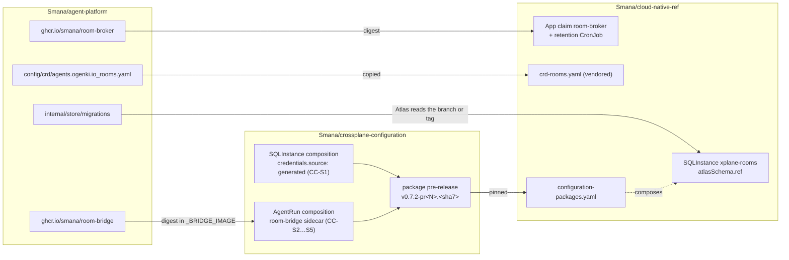

# Integration

This repository ships **two images, the `Room` CRD and the log's migrations**. Two other
repositories consume them: [cloud-native-ref](https://github.com/Smana/cloud-native-ref) deploys the
broker, its database, the CRD and the policies; [crossplane-configuration](https://github.com/Smana/crossplane-configuration)
adds the bridge to every `AgentRun` that names a room. Each consumer pins a build **by digest**, a PR
pre-release until the programme's merge wave, then a release.

## What each repository carries

### cloud-native-ref (S1…S6)

| PR | Phase | Carries |
|---|---|---|
| S1 | 1 | ADR-0044 (session protocol); the vendored `Room` CRD and its schema in the validation catalog; `SQLInstance xplane-rooms` with generated credentials and its CNPG network policy; the broker's `App` claim, config, RBAC and CNP; the `Certificate room-broker-tls` and `ExternalSecret room-broker-ca` (GP-18); the retention CronJob; the `VMServiceScrape`; the phase-1 `VMRule`; `task agent:run -- --room`; the umbrella child `room-broker` |
| S2 | 2 | ADR-0049 (room client and human auth); ZITADEL roles `agents-admin`, `agents-member` and the `rooms-proxy` client; oauth2-proxy; the `HTTPRoute` on the Tailscale Gateway; two broker replicas; the log's recovery seed |
| S3 | 3 | The `room-broker` backend on both MCPRoutes with its key and CNP; the factory App's key; egress to `api.github.com`; `RoomVerdictsNotReachingGitHub` |
| S4 | 4 | Pins |
| S5 | 5 | `RoomApprovalPendingTooLong`; pins |
| S6 | 6 | The `roomctl` ZITADEL native app; oauth2-proxy bearer tokens; pins; the verification record |

Every child an S PR adds to `clusters/aws-0-agent-platform/` gets its twin in
`clusters/gcp-0-agent-platform/` (GCP parity). The whole set sits in the `agent-platform` Flux
umbrella, suspended by default.

### crossplane-configuration (CC-S1…CC-S5)

| PR | Phase | Carries |
|---|---|---|
| CC-S1 | 1 | `SQLInstance.spec.credentials.source: store \| generated` (default `store`, every existing claim byte-identical) and login roles that own no database. In `generated` mode, a `Password` generator and an `ExternalSecret` per role, `refreshPolicy: CreatedOnce`, keys `username`, `password`, `uri`. It yields `xplane-rooms-cnpg-rooms` (owner), `xplane-rooms-cnpg-role-rooms-broker` and `xplane-rooms-cnpg-role-rooms-retention` |
| CC-S2 | 1 | With `roomRef`: the `room-bridge` native sidecar after `identity-proxy`; a `room-token` projected volume (audience `room-broker`, 600 s) mounted by the bridge alone; the `room-broker-ca` mount; kubelet ingress on 8085; the constant `_BRIDGE_IMAGE` |
| CC-S3 | 3 | The room rules in the agent's `rules.md`; `ROOM_ID` and `TASK_URL` for the harness; the harness pin that stamps the PR footer |
| CC-S4 | 4 | The bridge digest that steers |
| CC-S5 | 5 | The bridge digest that confirms; `BRANCH` for the bridge |

## Pins

| Consumer | Pins | From | Named |
|---|---|---|---|
| cloud-native-ref `infrastructure/base/room-broker/app.yaml` and `retention-cronjob.yaml` | The broker image, same digest in both | This repo's PR pre-release, then the release | `v0.0.1-pr<N>.<sha8>@sha256:…`, `<sha8>` = the PR head |
| cloud-native-ref `crd-rooms.yaml` | The `Room` CRD | This repo's `config/crd/`, re-copied with every broker pin | — |
| cloud-native-ref `sqlinstance.yaml` `atlasSchema.ref` | The migrations | The AP branch holding the phase's migrations while its PR is open; `main` once it merges; a `v*` tag from Phase 7 | A branch, then a tag |
| crossplane-configuration `apis/agentrun/kcl/main.k` `_BRIDGE_IMAGE` | The bridge image | This repo's PR pre-release, then the release | `v0.0.1-pr<N>.<sha8>@sha256:…` |
| cloud-native-ref `configuration-packages.yaml` | The composition package | crossplane-configuration's PR pre-release, then its release | `v0.7.2-pr<N>.<sha7>`, `<sha7>` = the PR's **synthetic merge commit**: copy it from the CI summary, never derive it |

Rules that keep pins honest:

- **Digest, never tag alone.** Read the digest with
  `skopeo inspect --raw docker://<ref> | sha256sum`, or copy it from the CI job summary.
- **Verify before pinning**: [security](security.md#supply-chain) gives the cosign command.
- **Re-vendor the CRD and move `atlasSchema.ref` with every broker pin**, so the three never drift.
- **A merged AP branch is gone**: a deleted branch 404s the composition's Git source. Once an AP PR merges, point `ref` at `main`: this repository deletes a branch on merge, and it has no release tag before Phase 7. The composition resolves a `v*` ref as a tag and anything else as a branch, so pin a commit SHA only if the composition accepts one; release tags come in Phase 7.
- **Crossplane never upgrades an installed package dependency.** During a live check, patch the core
  package to the same pre-release by hand.

## Contracts

### The broker's configuration

One file, `ROOMS_CONFIG` (a ConfigMap, Flux-substituted). Parsing is strict: an unknown key or a
`subPattern` without exactly one capture group fails the rollout, not the first request. The broker
reads it once at start, so restart it after a change. A machine issuer whose JWKS the broker cannot
fetch at start fails the rollout too; the `human` issuer does not: until it answers, humans get
`401` and agents are unaffected.

| Key | Meaning | Phase |
|---|---|---|
| `publicURL` | `https://rooms.<private domain>`, used in links | 1 |
| `runIssuers[]` | `{issuer, jwksURL, subPattern}`. The cluster's OIDC issuer today; its JWKS URI is per cloud (`<issuer>/keys` on EKS, `<issuer>/jwks` on GKE) | 1 |
| `systemIssuer` | `{issuer, jwksURL}` for `rooms-system` tokens | 1 |
| `systemPrincipals` | `{: <principal>}`. Ships empty; SP3 adds `system:serviceaccount:agent-system:agent-factory: system:factory` | 1 |
| `human` | `{issuer, jwksURL, clientIDFile, roomctlClientIDFile, projectIDFile, origin, groups: {admin, member}}`. The ids are files read at use, because ZITADEL mints new ones on every build (Ruling AS-a); the group names are literals | 2, 6 |
| `factoryURL` | SP3's run API. Unset: `start_run` returns a manifest for the owner to apply | 4 |
| `tls` | `{certFile, keyFile}` of `:8443`; default `/etc/room-broker/tls/tls.{crt,key}` (GP-18). Re-read when they change | 1 |

| Broker environment | Meaning | Phase |
|---|---|---|
| `ROOMS_CONFIG` | Path of the config file | 1 |
| `ROOMS_DATABASE_URL` | The `uri` of `xplane-rooms-cnpg-role-rooms-broker` (the retention job: `…-rooms-retention`) | 1 |
| `POD_NAMESPACE` | Where Rooms and the leader lease live | 1 |
| `LOG_FORMAT`, `LOG_LEVEL` | `json`, `info` (defaults); `text` and `debug` locally | 1 |
| `ROOMS_MCP_KEY` | The key the MCPRoute injects. Unset: `:8090` refuses every call | 3 |
| `ROOMS_GITHUB_APP_DIR` | The factory App's key volume (`app_id`, `private_key`; P31: optional, `defaultMode: 0440` with the pod's `fsGroup`). Unset: no verdict is posted. Set but empty: verdicts wait, up to 24 h, for the key | 3 |

### The bridge's environment

Set by the `AgentRun` composition (CC-S2).

| Variable | Value |
|---|---|
| `ROOM_ID`, `RUN_ID` | The run's `roomRef` and id |
| `CONVERSATION_ID` | The harness conversation: the `AgentRun`'s uid |
| `BROKER_URL` | `https://room-broker.agent-system.svc.cluster.local:8443` |
| `BROKER_CA_FILE` | `/etc/room-broker-ca/ca.crt` |
| `HARNESS_URL` | `http://127.0.0.1:8000` |
| `ROOM_TOKEN_FILE` | `/var/run/secrets/agents/room/token` |
| `EGRESS_PROFILES` | The run's egress profiles, comma-separated. The classifier reads them: a package install outside them is `egress.new` (phase 5) |
| `HEALTH_ADDR` | `:8085` (default): `/healthz` for kubelet only. The bridge serves no metrics; the broker counts its stalls and stubs (Ruling AP) |
| `LOG_FORMAT`, `LOG_LEVEL` | `json`, `info` (defaults); `text` and `debug` locally |
| `FLUSH_GRACE` | How long the SIGTERM drain may take; `25s` (default), at most `28s`. Set it lower when the harness uses much of the pod's 30 s grace: the kubelet signals the sidecar only after the harness exits |
| `GOMEMLIMIT` | Unset: the binary sets `48MiB`, the soft heap limit its buffer budget is sized for inside the 64 Mi limit. A pod spec may set its own |
| `BRANCH` | The run's branch (phase 5, CC-S5): the one push that is `forge.push`. Unset, every push is `forge.other` |

Resources: requests 20m / 32Mi, limits 100m / 64Mi; read-only root filesystem, all capabilities
dropped.

### What the broker reads from `AgentRun` (SP1)

`spec.roomRef` (immutable), `spec.role`, `spec.principal`, `spec.branch`, `spec.budget.maxMinutes`,
`spec.dataClass`, `spec.egress.profiles`, `spec.repository`, `status.phase`, `status.startedAt`, the
annotation `agents.ogenki.io/revoked`, and `metadata.uid`. The run's CNP already opens egress to
`room-broker` on 8443, and DNS for its name, when `roomRef` is set.

### What SP3's factory gets

| Contract | Where |
|---|---|
| Create a room | Create a `Room` CR with `spec.owner` and `spec.driver: system:factory` and the required `spec.dataClass` ([fields](concepts.md#the-room-crd)) |
| Read a room | `GET /v1/rooms/{id}/events` on `:8443`, audience `rooms-system` ([API](api.md#get-v1roomsidevents)) |
| Report task state | `POST /v1/rooms/{id}/messages`, `kind: task_state` |
| Verdicts and handoffs | `message{kind: review_verdict}` and `handoff` in the log (phase 3); the verdict comment is the broker's, SP3 never posts it again |
| Who drives | `Room.status.driver` and `driverEpoch`: the factory never advances a room while a `human:` holds the token |
| Run requests to SP3 | From phase 4, `POST {factoryURL}/v1/runs` with `{role, repository, baseRef, task, dataClass, roomRef, egressProfiles?}`, the human's access token as `Authorization: Bearer`, and `Idempotency-Key: <roomId>:<originClient>:<originSeq>`, the act's own key. **The factory must answer a key it has seen with the same `runId` and create nothing** (review 4.4 I1): the broker requests the run, then records it, and a client retrying a failed record sends the same key. A request without a key is refused before the call. Until SP3 the rendered claim's run id is derived from the same key, so applying both claims makes one run. SP3 should also refuse a second pending run per `roomRef`, which closes the cross-replica race the broker's `room_busy` cannot see. The `Idempotency-Key` alone decides: a replay gets the first request's `runId` whatever its body |

### Starting a run in a room before SP3

`task agent:run -- --room <roomId>` (cloud-native-ref, S1) sets `spec.roomRef` and defaults
`spec.branch` to `agent/<roomId>`, since a human room's runs share one branch (C3). An explicit
`--branch` wins; a room id that is not a C2 id is refused.

## Merge order

This repository merges each PR to `main` once it is green (the owner lifted the plan's no-merge rule,
P33, for this repository only). cloud-native-ref and crossplane-configuration keep their stacks open
until the owner's UX sign-off, then merge in one wave that re-pins everything to releases: this
repository's release first, then the harness, then crossplane-configuration's release, then
cloud-native-ref. See [roadmap](roadmap.md#phase-7-ux-sign-off-then-the-merge-wave).
