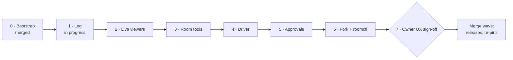
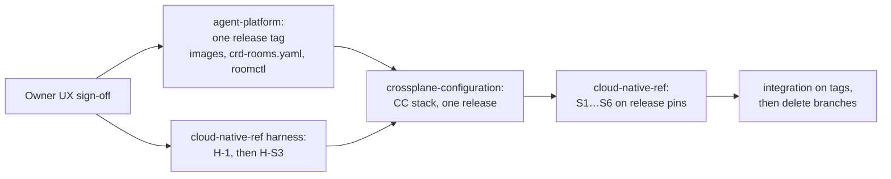

# Roadmap

**Phase 0 is merged. Phase 1 is in progress**: on the AP-1 branch the envelope, redaction, the log
schema, the store and the `Room` CRD are written and tested (tasks 1.1–1.5), Ruling Y's hardening
of the log is being applied, and tasks 1.6 onwards are next. Phases 2 to 6 are planned. Phase 7 is the
owner's UX sign-off, after which cloud-native-ref and crossplane-configuration merge in one wave.

Status as of 2026-09-29.

## Phases

Each phase is one pull request here (`AP-<N>`), one in cloud-native-ref (`S<N>`) and sometimes one
in crossplane-configuration (`CC-S<N>`). The phase's **gate** is the success criteria it must prove live.

| Phase | Adds | agent-platform | crossplane-configuration | cloud-native-ref | Gate | Status |
|---|---|---|---|---|---|---|
| 0 · Bootstrap | Module, toolchain, `task check`, CI, signed multi-arch images, stub binaries | AP-0 | — | — | Pre-release images pull anonymously | **Merged** |
| 1 · The log | Envelope, redaction, the store and its migration, the `Room` CRD and controller, offline authentication, the `AgentRun` watch and end reasons, `:8443` over TLS, the bridge, the broker binary and metrics | AP-1 | CC-S1 (generated credentials), CC-S2 (the bridge sidecar) | S1 | SC-1, SC-8, SC-10; a run's transcript and end reason outlive its pod | **In progress** |
| 2 · Live viewers | The permission matrix, human authentication, Valkey fan-out, WebSocket replay, a read-only web UI, two replicas | AP-2 | — | S2 | SC-2, SC-9, SC-11, SC-12 | Planned |
| 3 · Room tools | `room_read`, `room_post`, `room_handoff`, `room_verdict` on `:8090`; verdicts posted on the PR; the PR provenance footer | AP-3 | CC-S3 | S3, H-S3 (harness) | SC-4 (owner creates each run), SC-14, SC-15 | Planned |
| 4 · Driver and messages | Driver token, queue, steering, interrupt, the brief, hand to role, new rooms | AP-4 | CC-S4 | S4 | SC-3, SC-4 by hand to role | Planned |
| 5 · Approvals | Classification, the confirmation loop, first decision wins, four-eyes, TTL, approval cards | AP-5 | CC-S5 | S5 | SC-5, SC-6 | Planned |
| 6 · Fork and `roomctl` | Fork at any `seq`, the CLI | AP-6 | — | S6 | SC-7, SC-13, verification | Planned |
| 7 · UX sign-off and merge wave | The owner's sign-off, then releases and re-pins | release tag | release | merges S1…S6 | SC-13 on `main` | Planned |

## Phase 1 in detail

| Task | What | Where | Status |
|---|---|---|---|
| 1.1 | The C4 envelope | AP-1, `internal/envelope` | Implemented |
| 1.2 | Redaction | AP-1, `internal/redact` | Implemented |
| 1.3 | Log schema and Atlas migration | AP-1, `internal/store/migrations` | Implemented; Ruling Y's grants, trigger and check being added |
| 1.4 | The store | AP-1, `internal/store` | Implemented; Ruling Y's lease fencing being added |
| 1.5 | The `Room` CRD, bounds included | AP-1, `api/v1alpha1`, `config/crd` | Implemented |
| 1.6 | Offline authentication for runs and system callers | AP-1, `internal/authn` | Planned |
| 1.7 | The `AgentRun` watch, run events, end reasons | AP-1, `internal/runwatch` | Planned |
| 1.8 | The `Room` controller | AP-1, `internal/roomctrl` | Planned |
| 1.9 | The bridge and system API on `:8443`, TLS (GP-18), the lease `409` (Ruling Y) | AP-1, `internal/bridgeapi` | Planned |
| 1.10 | The harness adapter and event mapping | AP-1, `internal/bridge` | Planned |
| 1.11 | The `room-bridge` binary, trusting the broker CA (GP-18) | AP-1, `cmd/room-bridge` | Planned |
| 1.12 | The broker binary, metrics, retention subcommand, AP-1's pre-release | AP-1, `cmd/room-broker`, `internal/app` | Implemented; pre-release pending |
| 1.13 | `SQLInstance` generated credentials | CC-S1 (crossplane-configuration) | Implemented, in review |
| 1.14 | The bridge in the `AgentRun` composition | CC-S2 | Planned |
| 1.15–1.22 | ADR-0044, the vendored CRD, storage, the broker's manifests, alerts, `agent:run --room`, pins, the live gate | S1 (cloud-native-ref) | Planned |

The live gate runs on gcp-0: the GCP parity work made it the platform, and aws-0 is not deployed.

## Phase numbering

The plan reorders the design's phases, and its phase 7 is not the design's. This guide uses the
plan's numbers.

| Design phase | Plan phase | Why it moved |
|---|---|---|
| 1 · Log | 1 | — |
| 2 · Live viewers | 2 | — |
| 3 · Driver and messages | 4 | Ruling P1: room tools only append and need no driver, and reviewer, tester and triager output needed a destination first |
| 4 · Approvals | 5 | Same |
| 5 · Room tools | 3 | Same |
| 6 · Fork + `roomctl` | 6 | — |
| 7 · gcp-0 | spread over phases 1–6 | Ruling P2, reversed by the GCP parity work: gcp-0 is in scope from phase 1, including TLS on `:8443` (GP-18) and the per-cloud issuer |
| — | 7 · UX sign-off and merge wave | Ruling P33 |

## Phase 7: UX sign-off, then the merge wave

The owner, 2026-09-27: *"I don't want to merge any SPx until I get the whole picture done and we agree
on the ux."*

| Repository | Before the sign-off |
|---|---|
| agent-platform | Each PR merges to `main` when green: the owner lifted the no-merge rule (P33) for this repository only, on 2026-09-29 |
| cloud-native-ref, crossplane-configuration | Stacks stay open, one PR on the next, merged into each other and never rebased. Live gates run on an integration branch with pre-releases pinned by digest |

The gate is the owner's written sign-off after walking the whole programme on a cluster: the rooms
UI, `roomctl`, the verdict comment and PR footer, approvals and fork. Nothing in the other two
repositories merges before it. Then one wave, in dependency order:

In cloud-native-ref and crossplane-configuration, automatic branch deletion is turned off during the
wave: a deleted branch would 404 every Git source still tracking it. This repository already deletes
branches on merge, so once an AP PR merges, `atlasSchema.ref` points at `main` until the release
tags of Phase 7.

## Not in this roadmap

| Item | Owner |
|---|---|
| The factory's `POST /v1/runs`, the one-creator Kyverno rule, the factory's `rooms-system` token | SP3 |
| GitHub review feedback entering a room; rooms narrating on GitHub or Slack | SP3 |
| Budget enforcement on the agent gateway | SP4 |
| Transparent resume of a lost pod | SP1 follow-up; the room records `pod_lost` |
| An AHP facade | Later, at AHP 1.0 |
| Human presence and typing indicators | Later (ruling P27) |
| The bridge relay for room tools, if the gateway does not project `x-ar-agent` | A follow-up plan (ruling P36); phase 3 stops at its first step if it is needed |

Non-goals of the design: AHP wire compatibility now, agents from outside the cluster, rooms spanning
clusters, concurrent runs in one room, widening a live run, harness memory on fork, co-editing, a
shared terminal or voice, and a human's local agent acting in a room for them.
