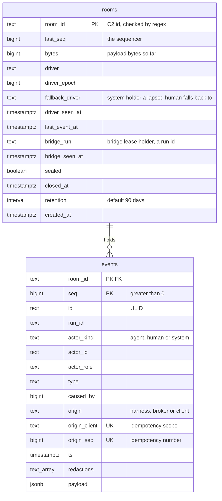
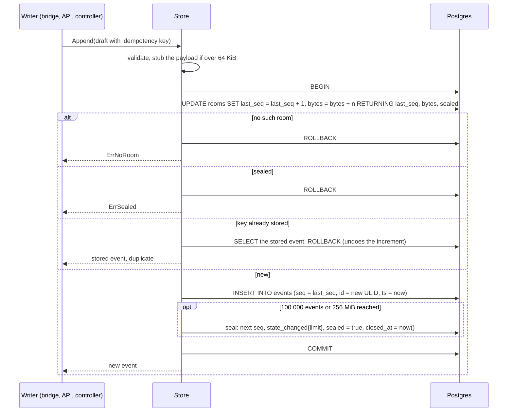

# The room log

The log is one PostgreSQL database, `rooms`, on the CNPG cluster of `SQLInstance xplane-rooms`. Two
tables hold it: `rooms`, one row per room that doubles as its sequencer, and `events`, the log
itself. The broker may append and read, never rewrite. **Ruling Y moves the remaining guarantees
into the database** (grants, a trigger and an insert check), so that even a compromised broker
cannot unseal a room, re-date it into early deletion, or leave a gap in its sequence. Ruling Y lands
with AP-1; the rest of this page's schema is on the AP-1 branch today.

## Schema



`events` has primary key `(room_id, seq)` and a unique key `(room_id, origin_client, origin_seq)`.
Later phases add columns and tables (see [migrations](#migrations-with-atlas)).

### Roles

| Role | Created by | Can | Used by |
|---|---|---|---|
| `rooms_owner` | CNPG, from the `SQLInstance` claim; owns the database | Owns the schema. No `CREATEROLE` | The Atlas migration |
| `rooms_broker` | CNPG managed role, owning no database | `SELECT`, `INSERT` on `events`; `SELECT`, `INSERT` and (Ruling Y) a column-level `UPDATE` on `rooms` | The broker |
| `rooms_retention` | CNPG managed role, owning no database | `DELETE` on `events` and `rooms`; `SELECT` on `events.room_id` and on the expiry columns of `rooms` only; both narrowed by row-level security to expired rooms | The retention job |

Each role's password is generated in the cluster by an External Secrets `Password` generator, never
seeded by hand, through the `SQLInstance`'s `credentials.source: generated` (CC-S1, ruling P7). The
broker's connection string arrives as the key `uri` of Secret `xplane-rooms-cnpg-role-rooms-broker`.

## The guarantees

The spec's T12 says a compromised broker cannot rewrite history. The review of AP-1's first store
found that the planned schema did not hold that line: a table-wide `UPDATE` on `rooms` and a
`FOR ALL` row policy let the broker role back-date `closed_at` or zero `retention`, after which the
retention job would delete an **open** room's events; unseal a sealed room; or jump `last_seq` and
leave a gap. It also found that a displaced bridge could keep appending. **Ruling Y** fixes all of
it in the same, still unreleased, migration: nothing has been deployed, so nothing needs a second
one.

| Guarantee | Enforced by | Proved by | Status |
|---|---|---|---|
| The broker cannot change or delete an event | Grant: `rooms_broker` has only `SELECT`, `INSERT` on `events` | `TestBrokerRoleIsAppendOnly` (`42501 permission denied`); SC-10 (S1 live gate) | AP-1 |
| `seq` is gapless per room, from 1 | Row lock: every append increments `rooms.last_seq` in the same transaction as its insert, and a rollback undoes the increment. Ruling Y adds a `BEFORE INSERT` check on `events`: `seq` must equal the room's `last_seq` | `TestAppendIsGapless`; SC-1 live (`max(seq) = count(*)`); the check's test lands with Ruling Y | Lock AP-1; check AP-1, Ruling Y |
| An append is idempotent | Unique key `(room_id, origin_client, origin_seq)`, read under the row lock; a replay rolls back and returns the stored event | `TestAppendIsIdempotentAndStaysGapless` | AP-1 |
| Nothing appends to a sealed room | The store refuses under the row lock (`ErrSealed`, `410 sealed`). Ruling Y adds the database check: the `events` insert check refuses a sealed room | `TestSealedRoomRefusesAppends`; the database check's test lands with Ruling Y | Store AP-1; check AP-1, Ruling Y |
| A sealed room stays sealed | Trigger: a `rooms_owner`-owned `BEFORE UPDATE` trigger refuses `sealed` going from true to false | Test lands with Ruling Y | AP-1, Ruling Y |
| `closed_at` is set once, to the time of closing | The same trigger: `closed_at` may only move from null to `now()` | Test lands with Ruling Y | AP-1, Ruling Y |
| `retention` and `room_id` never change | The same trigger | Test lands with Ruling Y | AP-1, Ruling Y |
| `last_seq` moves only by +1 | The same trigger | Test lands with Ruling Y | AP-1, Ruling Y |
| The broker updates only what it must move on `rooms` | Grant: a column-level `UPDATE` instead of the table-wide one, and no `FOR ALL` policy | Test lands with Ruling Y | AP-1, Ruling Y |
| Retention deletes only sealed rooms closed longer ago than their retention | Row-level security on `rooms_retention`: `closed_at < now() - retention`; Ruling Y adds `sealed` | `TestRetentionDeletesOnlyExpiredClosedRooms` | RLS AP-1; `sealed` AP-1, Ruling Y |
| Retention never reads a transcript | Grant: `rooms_retention` may `SELECT` only `events.room_id` and the expiry columns of `rooms` (`room_id`, `sealed`, `closed_at`, `retention`); its `SELECT` policies show only expired rooms (Ruling AX) | `TestRetentionRoleCannotReadTranscripts` (`42501`, and a live room's rows invisible) | AP-1, Ruling AX |
| A full room seals itself | The store: at 100 000 events or 256 MiB the append also writes the seal | `TestLimitSealsTheRoom` | AP-1 |
| An oversize payload keeps its slot | The store replaces a payload over 64 KiB with a stub | `TestOversizePayloadIsStubbed` | AP-1 |
| A value Postgres refuses keeps its slot | `IsDataError` spots SQLSTATE class 22; the API stores a stub instead | `TestNULIsADataError` | Store AP-1; stub planned, task 1.9 |
| One bridge holds a room | The lease in the room's row, shared by every replica (ruling P17) | `TestBridgeLeaseIsSharedAndExpires` | AP-1 |
| A displaced bridge cannot append | Ruling Y: renewing the lease reports whether it is still held, and an append carries the expected `bridge_run`, checked under the row lock. `POST /v1/bridge/events` answers `409` when it is not held | Tests land with Ruling Y (store) and task 1.9 (API) | AP-1, Ruling Y |

The exact column list of the `UPDATE` grant and the trigger's error messages are fixed by the AP-1
migration; this page describes their contract.

## Append

One transaction per event. The row lock on `rooms` serialises every writer of a room across every
broker replica, so `seq` is gapless without an application lock.



The caller redacts first: every payload passes through the redactor before `Append` (see
[security](security.md#redaction)).

## Sealing and closing

| Trigger | Final event | Effect |
|---|---|---|
| The `Room` CR is deleted: its finalizer deletes the room's runs, then closes the log | `state_changed{kind: room_phase, phase: Closed, reason: "room deleted"}` | `sealed = true`, `closed_at = now()`: the retention clock starts |
| The room reaches 100 000 events or 256 MiB | `state_changed{kind: limit, events, bytes}` | Same |
| The owner or SP3 closes the room (the `close` action, phase 4) | `state_changed{room_phase: Closed}` | Same |

The seal is itself an event, with the fixed key `broker:seal/1`, so it is appended at most once.
Closing a sealed room is a no-op. After the seal every append gets `ErrSealed`, and a bridge that
receives `410 sealed` stops mirroring.

## Retention

A daily CronJob (S1), `room-broker-retention` (03:17, `concurrencyPolicy: Forbid`), runs
`room-broker retention` as `rooms_retention`. It deletes the events, then the row, of every room
closed longer ago than its own retention, one room per transaction so each stays under the session's
`statement_timeout`. Its `WHERE` clause repeats what row-level security already
enforces: the role cannot see, let alone delete, anything else.

| Setting | Value |
|---|---|
| `Room.spec.retention` | `<n>d`, 1 to 9999 days; default `90d` (OD-17). Copied into `rooms.retention` when the row is created and never changed afterwards (Ruling Y) |
| Clock | Starts at `closed_at`, the seal |
| Sizing | About 4 MB per run; 20 runs a day for 90 days is about 7 GB on a 20 Gi volume. `RoomLogDiskFilling` fires at 80 % |
| Later tables | Phase 4's `queue` and phase 5's `approvals` add their own `DELETE` before the `rooms` one, and a matching policy |

A forked room copies its source's events (phase 6), so a fork survives its source's purge.

## The bridge lease

One `Running` run per room (spec §1) is enforced where every replica can see it: in the room's row.

| Step | Rule |
|---|---|
| `hello` | `ClaimBridge` locks the row. Another run keeps the lease while it is still live in the `AgentRun` watch **and** was seen within 2 minutes; otherwise the caller takes it |
| Refused | `409 room_busy`, and one `state_changed{kind: limit, reason: concurrent_run, running: <holder>}` |
| Renewal | Every batch the holder pushes updates `bridge_seen_at`, fenced like an append. A bridge with nothing to push for 30 s sends an empty batch, so a quiet run (a long LLM call, a pending confirmation) keeps its room |
| A run that ended | Frees the lease at once |
| A holder that died without ending its run | Blocks the room for at most 2 minutes |
| Fencing (Ruling Y) | Each append checks, under the same row lock, that the caller's run still holds the lease; a displaced bridge gets `409` and appends nothing |

The broker cannot refuse to *create* a second run (it creates none), but no second run joins the
room while the first is live. The second run still spends tokens until someone deletes it.

The driver token (phase 4) uses the same pattern: every driver-only action carries `driverEpoch`,
and applies only if `UPDATE rooms … WHERE driver_epoch = $epoch` matches.

## Migrations with Atlas

| Item | Where |
|---|---|
| Migration files | `internal/store/migrations/<timestamp>_<name>.sql`, applied in name order |
| Integrity file | `internal/store/migrations/atlas.sum` |
| ConfigMap generator | `internal/store/migrations/kustomization.yaml` builds the ConfigMap `atlas-db-migrations`, the name the `SQLInstance` composition reads. Every migration file of every phase is listed there, with `atlas.sum` |
| Applied by | The Atlas operator in the cluster, connected as `rooms_owner`, from the claim's `atlasSchema: {url, ref, path: internal/store/migrations}` |
| `ref` | The AP branch that holds the phase's migrations while its PR is open. A deleted branch 404s the composition's Git source. Once an AP PR merges, point `ref` at `main`: this repository deletes a branch on merge, and it has no release tag before Phase 7. The composition resolves a `v*` ref as a tag and anything else as a branch, so pin a commit SHA only if the composition accepts one; release tags come in Phase 7 |

| Migration | Adds | Phase |
|---|---|---|
| `20260927120000_rooms.sql` | `rooms`, `events`, the grants and row-level security; Ruling Y's trigger, check and column grant | 1 / AP-1 |
| `20261001120000_driver_queue.sql` | `rooms.driver_acted_at`, the `queue` table | 4 / AP-4 |
| `20261005120000_approvals.sql` | The `approvals` table | 5 / AP-5 |

**`atlas.sum` must match the directory.** It is a checksum of every migration file and of their
order. Atlas refuses to apply a directory whose files do not match it, which catches a migration
edited after it was hashed, and two branches adding migrations out of order. After adding or editing
a file, regenerate it and validate:

```bash
atlas migrate hash --dir file://internal/store/migrations
atlas migrate validate --dir file://internal/store/migrations
```

Commit the new `atlas.sum` with the SQL. A migration that has run anywhere is never edited again:
add a new file. Ruling Y edits the first migration in place only because nothing has run it yet.

The `GRANT`s name login roles that CNPG creates, not the migration (`rooms_owner` has no
`CREATEROLE`). Until CNPG has created them the migration fails, and the Atlas operator retries.
